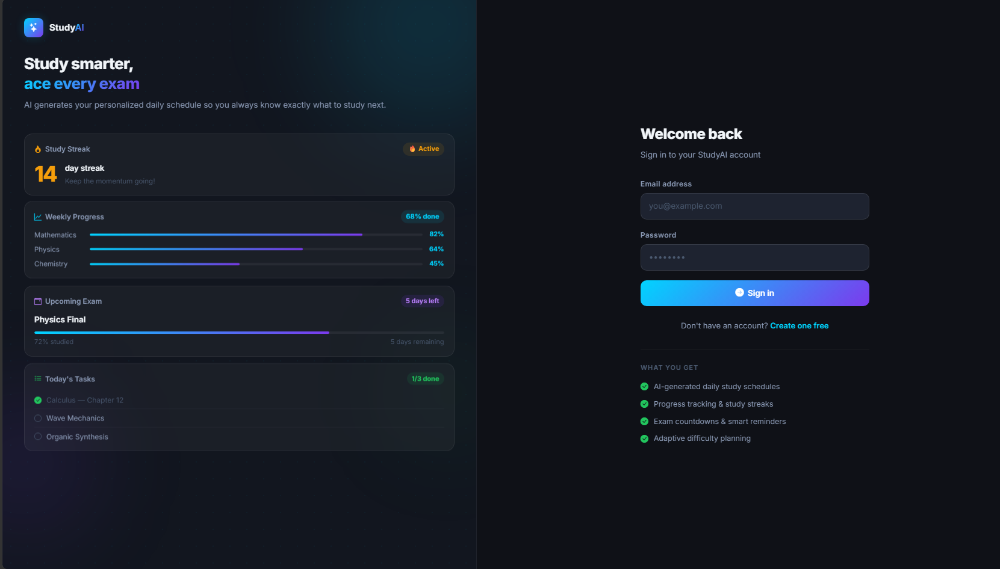
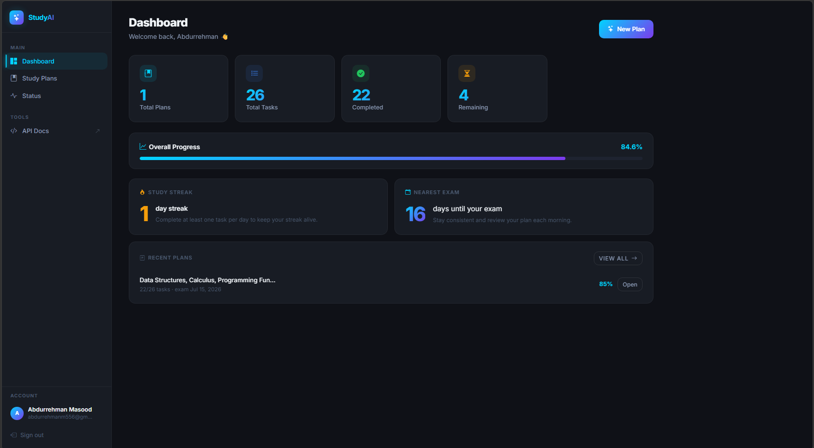
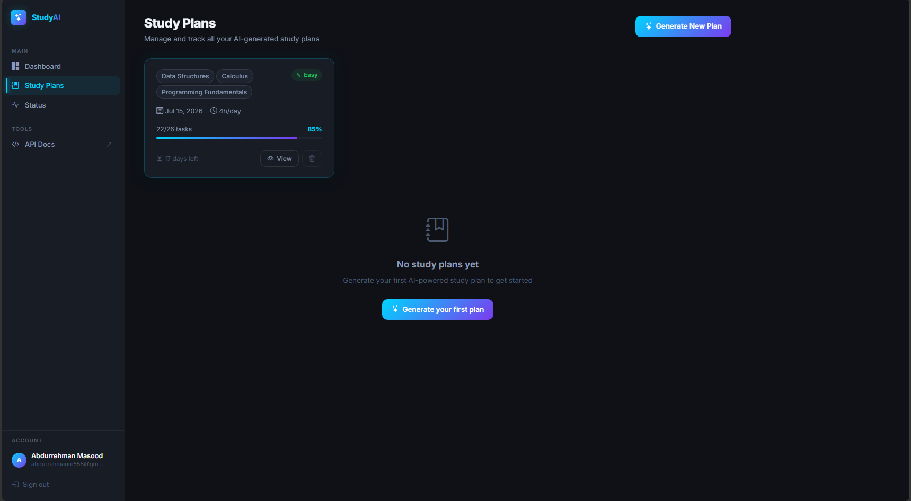
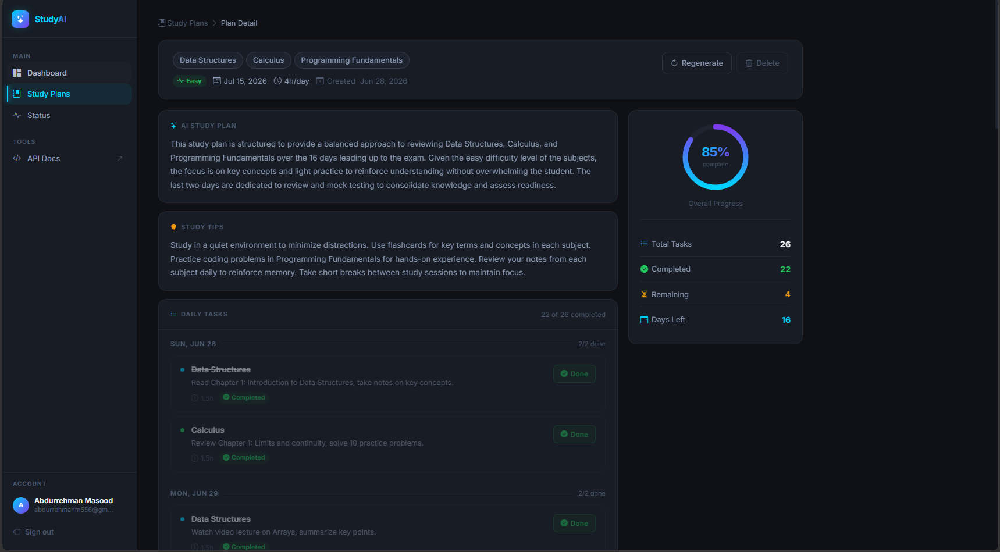
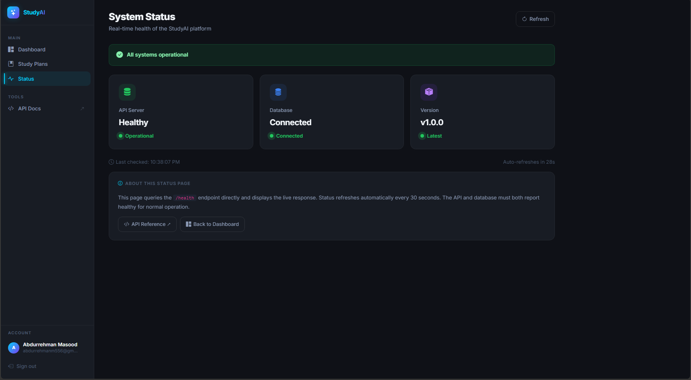

# StudyAI

An AI-powered study planning platform that generates personalized study schedules, tracks progress, and helps students prepare efficiently for exams.

---

## Screenshots

### Login



### Dashboard



### Study Plans



### Study Plan Detail



### Status



---

## Features

* JWT authentication with secure registration and login
* AI-generated study plans powered by OpenAI GPT-4o-mini
* Personalized schedules based on subjects, exam date, and study hours
* Daily task generation and management
* Progress tracking with analytics
* Study streak monitoring
* Days until exam countdown
* Plan regeneration
* Task completion tracking
* Dashboard with overall statistics
* Status monitoring page
* PostgreSQL persistence
* Responsive dark-themed interface
* Swagger API documentation

---

## Tech Stack

### Backend

* Python
* FastAPI
* PostgreSQL
* SQLAlchemy
* Alembic

### Authentication

* JWT
* OAuth2
* Passlib
* bcrypt

### AI

* OpenAI GPT-4o-mini

### Frontend

* Jinja2
* HTML5
* CSS3
* Bootstrap 5
* JavaScript

### Deployment

* Render
* Docker (optional)

---

## Frontend Routes

| Route             | Description      |
| ----------------- | ---------------- |
| `/login`          | Login page       |
| `/register`       | Register page    |
| `/app/dashboard`  | Dashboard        |
| `/app/plans`      | Plans page       |
| `/app/plans/{id}` | Plan details     |
| `/app/status`     | Status page      |
| `/docs`           | Swagger API docs |

---

## API Documentation

http://localhost:8000/docs

---

## Local Setup

### Clone repository

```bash
git clone https://github.com/yourusername/study-planner.git

cd study-planner
```

### Create virtual environment

```bash
python -m venv venv

venv\Scripts\activate
```

### Install dependencies

```bash
pip install -r requirements.txt
```

### Create .env

```env
OPENAI_API_KEY=your_key

DATABASE_URL=your_postgresql_url

SECRET_KEY=your_secret_key
```

### Run migrations

```bash
alembic upgrade head
```

### Start server

```bash
uvicorn main:app --reload
```

Visit:

```text
http://localhost:8000
```

Dashboard:

```text
http://localhost:8000/app/dashboard
```

Swagger:

```text
http://localhost:8000/docs
```

---

## Project Structure

```text
study-planner/

app/
templates/
static/
alembic/
tests/

main.py

requirements.txt

README.md
```

---

## Future Improvements

* Google Calendar integration
* Email reminders
* Mobile responsive enhancements
* User profiles
* AI study recommendations
* SaaS subscription model

---

## Author

Abdurrehman Masood

Computer Engineering Student • COMSATS Lahore
